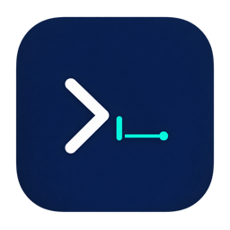

<div align="center">
  

# MacSSH

**原生、轻量、安全的 macOS Terminal + SSH + SFTP 工作台**

[功能概览](#功能概览) · [快速开始](#快速开始) · [构建与测试](#构建与测试) · [安全设计](#安全设计) · [项目文档](#项目文档)
</div>

MacSSH 是一款使用 Swift、SwiftUI 与 AppKit 构建的原生 macOS 客户端，将本地终端、SSH 主机管理、远程终端、SFTP 文件操作和传输队列整合在同一个应用中。项目不使用 Electron、Chromium、WebView 或其他 Web 套壳技术。


## 功能概览

### 本地终端

- 基于 SwiftTerm 与 PTY 的原生本地 Terminal。
- 使用 `/usr/bin/login -p -f <user>` 启动账户默认 login shell，兼容 zsh、bash、fish 等系统已配置 Shell。
- 支持多标签页、复制粘贴、选择、滚动、窗口尺寸同步和全屏命令行程序。
- 支持 ANSI Color、256 Color、TrueColor、中文和 Emoji。
- 内置 JetBrains Mono，并由 PingFang SC 与 Apple Color Emoji 提供中文和 Emoji fallback。
- Terminal 前景色、背景色和选区颜色随 macOS Light / Dark Appearance 动态更新，不重建 Shell 或会话。

### SSH 与主机管理

- 使用 SwiftData 保存 Host、Host Group 与 Known Host 等非敏感数据。
- 支持主机创建、编辑、删除、搜索、分组和收藏。
- 支持 Password 与 Private Key 两种 SSH 认证方式。
- Password 和 Private Key Passphrase 只存入 macOS Keychain，不写入 SwiftData。
- 首次连接支持 Trust Once / Trust Always；Host Key 发生变化时阻止认证并显示明确警告。
- 支持远程 PTY、交互式 Shell、窗口 Resize、断线状态展示和 Reconnect。
- 同一应用内可同时管理多个本地与远程 Terminal Session。

### SFTP 与传输队列

- 支持目录浏览、上级目录、刷新和远程路径导航。
- 支持上传、下载、重命名、删除和新建文件夹。
- 上传与下载采用固定大小缓冲区流式传输，不把整个大文件载入内存。
- 统一传输队列提供进度、速度、等待、完成、失败和取消状态。
- 关闭会话或退出 App 时会先取消并等待相关传输收尾。

### 本地化与原生体验

- 支持简体中文与 English，并可在 Settings 中即时切换。
- 语言切换只刷新界面文案，不重建 Local Shell、SSH、SFTP 或传输状态。
- 使用原生 `NavigationSplitView`、Toolbar、Sheet、Alert、Context Menu 与键盘快捷键。
- 支持 `⌘T` 新建本地终端、`⌘W` 关闭当前标签，以及 `⌘1`～`⌘9` 切换标签。

## 当前状态

| 项目 | 当前值 |
| --- | --- |
| 源码开发线 | MacSSH 1.1 |
| 工程版本 | 1.0.0（Build 1，尚未在 1.1 开发阶段提升版本号） |
| 最低系统 | macOS 14.0 |
| 架构 | Apple Silicon `arm64` |
| Swift | Swift 6 |
| Bundle Identifier | `com.macssh.MacSSH` |
| App Sandbox | 关闭 |
| Hardened Runtime | 开启 |
| 已有发布形态 | ad-hoc 签名的本地/内部测试构建 |
| Developer ID / Notarization | 尚未完成，等待 Apple Developer Program 条件 |

详细的逐阶段实现、验收结果、测试数量与已知问题，以 [Docs/DevelopmentStatus.md](Docs/DevelopmentStatus.md) 为准。

## 技术架构

```text
SwiftUI / AppKit
       │
       ├── AppState
       │    ├── SessionManager ── Local / Remote Terminal Session
       │    ├── SSHService ────── SSHConnection actor ── libssh2
       │    └── TransferManager ─ SFTP / Streaming Transfer
       │
       ├── SwiftData ──────────── Host / HostGroup / KnownHost
       └── macOS Keychain ─────── Password / Private Key Passphrase
```

核心边界：

- View 不直接调用 libssh2，而是通过 Service 层进入 SSH Core。
- SSH Connection、Terminal Session 和 Transfer Manager 独立于 SwiftUI View 生命周期。
- `SSHConnection` 使用 Swift actor 串行管理同一个 libssh2 session handle。
- SwiftData 只保存普通业务数据；Secret 统一通过 `CredentialService → KeychainService` 处理。
- libssh2 与 OpenSSL 静态链接，运行时不依赖 Homebrew 路径中的动态库。

## 主要依赖

| 依赖 | 用途 | 固定版本 / Revision |
| --- | --- | --- |
| SwiftTerm fork | VT100/Xterm Terminal Engine、AppKit Terminal View、PTY | `8a5187fe8182bac3a01f2b82d2621993de5886be` |
| libssh2 | SSH、PTY、SFTP | `1.11.2_DEV` @ `be937743a85c4064a6399cee39e606672a401069` |
| OpenSSL | libssh2 加密后端 | `3.5.8`（3.5 LTS） |
| JetBrains Mono | Terminal 默认字体 | `19371302b95d218af43299bce79ddbddd0bc364d` |

SwiftTerm 通过 Swift Package Manager 的不可变 revision 获取。libssh2 与 OpenSSL 的固定来源、SHA256、构建选项和静态库身份记录在 [ThirdParty/MANIFEST.txt](ThirdParty/MANIFEST.txt)；MacSSH 使用的 SwiftTerm fork 与 VS16 宽度策略见 [Docs/SwiftTermFork.md](Docs/SwiftTermFork.md)。

## 环境要求

正常构建 App 需要：

- Apple Silicon Mac。
- macOS 14.0 或更高版本。
- 支持 Swift 6 的 Xcode 与 Xcode Command Line Tools。
- Xcode Metal Toolchain（SwiftTerm 的 Metal Shader 构建需要）。
- 首次通过 Xcode GUI 构建时，确认信任固定 revision 对应的 SwiftTerm Build Tool Plugin。

只有在重新构建 libssh2 / OpenSSL 静态依赖时，才额外需要 `cmake` 和网络连接。仓库已包含构建所需的固定静态产物，普通 App 构建不需要通过 Homebrew 安装 libssh2 或 OpenSSL。

## 快速开始

### 1. 获取源码

```bash
# 克隆 MacSSH 仓库，并把源码保存到当前目录下的 MacSSH 文件夹。
git clone https://github.com/canbyte0/MacSSH.git

# 进入项目根目录，后续命令都在这里执行。
cd MacSSH
```

命令含义：

- `git clone`：下载 Git 仓库及其提交历史。
- `https://github.com/canbyte0/MacSSH.git`：项目远程仓库地址。
- `cd MacSSH`：把当前工作目录切换到项目根目录。

### 2. 使用 Xcode 打开工程

```bash
# 使用系统关联的 Xcode 打开 MacSSH 工程文件。
open MacSSH.xcodeproj
```

命令含义：

- `open`：调用 macOS Launch Services 打开文件。
- `MacSSH.xcodeproj`：MacSSH 的 Xcode Project。

在 Xcode 中选择共享 Scheme `MacSSH` 和 `My Mac` 目标，然后运行。首次解析 Swift Package 时需要能够访问 GitHub。

## 构建与测试

### Debug 与 Release 构建

项目提供统一构建脚本，分别执行 Debug / Release 的 Apple Silicon clean build，并验证产物架构、代码签名和 warning 数量：

```bash
# 在项目根目录执行标准 Debug 与 Release arm64 构建。
bash Scripts/build-app.sh
```

命令含义：

- `bash`：使用 Bash 解释并运行脚本。
- `Scripts/build-app.sh`：清理独立 DerivedData，构建 Debug / Release，并检查两个 `.app` 产物。
- 构建日志写入 `/tmp/macssh-build-debug.log` 与 `/tmp/macssh-build-release.log`。

### 不依赖真实 SSH 凭据的测试

```bash
# 构建并运行 MacSSH 共享 Scheme 中的 XCTest；需要外部 SSH 环境的用例会按条件跳过。
xcodebuild test -project MacSSH.xcodeproj -scheme MacSSH -configuration Debug -destination 'platform=macOS,arch=arm64' -derivedDataPath /tmp/macssh-readme-tests -skipPackagePluginValidation -skipMacroValidation
```

命令含义：

- `xcodebuild test`：构建 App 和测试 Target 后运行 XCTest。
- `-project MacSSH.xcodeproj`：指定 Xcode 工程。
- `-scheme MacSSH`：使用仓库提交的共享 Scheme。
- `-configuration Debug`：采用 Debug 构建配置。
- `-destination 'platform=macOS,arch=arm64'`：在本机 macOS 的 arm64 目标上测试。
- `-derivedDataPath /tmp/macssh-readme-tests`：把本次构建缓存隔离到 `/tmp`。
- `-skipPackagePluginValidation`：跳过命令行环境中的重复插件确认；只应对已审阅并固定 revision 的依赖使用。
- `-skipMacroValidation`：跳过命令行环境中的宏重复确认；本项目依赖身份仍由锁文件与测试校验。

### 真实 SSH / SFTP 集成测试

> [!CAUTION]
> 以下脚本要求先在“系统设置 → 通用 → 共享”中开启“远程登录”。它会请求 macOS Keychain 授权，生成临时 SSH Key，并在 `~/.ssh/authorized_keys` 中写入带唯一标记的临时测试块；脚本退出时会自动清理。运行前请先阅读脚本。

```bash
# 运行真实 SSH、Host Key、Remote Terminal、SFTP 与传输集成测试。
bash Scripts/run-ssh-tests.sh
```

命令含义：

- `Scripts/run-ssh-tests.sh`：以本机 `127.0.0.1:22` 的 sshd 为测试服务器，创建临时凭据与文件夹具并运行集成测试。
- 测试密码不会作为命令行参数、环境变量或日志内容保存；脚本通过 Keychain 流程提供测试凭据。
- 完整日志写入 `/tmp/macssh-ssh-tests.log`，清理逻辑由脚本的 `EXIT` trap 执行。

### 重建原生静态依赖

通常不需要执行本步骤。仅在审计或更新固定依赖产物时使用：

```bash
# 从固定来源下载、校验并重新构建 arm64 的 OpenSSL 与 libssh2 静态库。
bash Scripts/build-dependencies.sh
```

命令含义：

- `Scripts/build-dependencies.sh`：校验下载文件 SHA256 与安全修复标记，再将静态库安装到 `ThirdParty/openssl` 和 `ThirdParty/libssh2`。
- 脚本需要 `cmake`、Xcode Command Line Tools 与网络；生成的 App 运行时不依赖 `cmake` 或 Homebrew。

## 项目结构

```text
MacSSH/
├── App/                    # 应用入口、全局状态与语言状态
├── Components/             # Sidebar、Toolbar、Dialog 和通用组件
├── Features/               # Hosts、Terminal、SFTP、Transfers、Settings 界面
├── Infrastructure/         # libssh2 bridging header 与日志基础设施
├── Models/                 # Host、Session、KnownHost、TransferTask 等模型
├── Resources/              # String Catalog 与 App Icon
└── Services/               # SSH、SFTP、Terminal、Transfer、Security 业务服务
Tests/                      # XCTest，按 Hosts / Security / SSH 分类
Scripts/                    # 构建、测试、依赖、打包、公证和发布验证脚本
ThirdParty/                 # 固定静态依赖、字体及依赖身份清单
Docs/                       # 开发状态、发布清单与专项技术说明
```

## 安全设计

- Password 与 Private Key Passphrase 只进入 macOS Keychain，并使用不同 service namespace 隔离。
- 私钥文件内容不写入 SwiftData；Host 仅保存用户选择的路径与 Keychain 引用。
- SSH Host Key 在发送认证凭据前验证；未知 Key 必须由用户明确选择，变化的 Key 默认阻断。
- 日志不记录 Password、Passphrase、Private Key、完整 Terminal 内容或可复用凭据 ID。
- SFTP 大文件使用流式 I/O；取消、关闭 Session 和退出 App 均有资源收尾屏障。
- Release 开启 Hardened Runtime，不启用 `get-task-allow`、JIT、unsigned executable memory 或 disable library validation 等例外。
- 发布与验证脚本不会关闭 Gatekeeper，也不会通过删除 quarantine 属性绕过系统安全检查。

## 发布说明与限制

- 当前支持 Apple Silicon `arm64`，尚未提供 Intel 或 Universal 2 构建。
- `MacSSH-1.0.0.dmg` 是 ad-hoc 签名、未公证的本地/内部测试产物。
- 从互联网下载未公证构建时，Gatekeeper 可能警告或阻止运行；正确解决方式是完成 Developer ID 签名与 Notarization，而不是关闭 Gatekeeper。
- 物理 SSH 断线时，服务器上可能保留由传输创建的 `.partial` 文件；应用会报告残留文件名，不会在未授权重连后静默删除。
- 干净机器与 quarantine 下载路径仍需在正式发布前单独验收。

完整的 1.0.0 构建身份、SHA256、验证结果和 Phase 12B 前置条件见 [Docs/Release-1.0.0.md](Docs/Release-1.0.0.md)。

## 项目文档

- [完整开发计划书](macOS%20原生%20Terminal%20%2B%20SSH%20%2B%20SFTP%20一体化客户端完整开发计划书.md)：产品边界、架构原则、Phase 顺序、测试矩阵和 1.0 成功标准。
- [开发状态](Docs/DevelopmentStatus.md)：每个阶段的实现范围、测试证据、验收状态与已知问题。
- [1.0.0 Release Manifest](Docs/Release-1.0.0.md)：ad-hoc 构建的签名、依赖、产物和验证清单。
- [SwiftTerm Fork 说明](Docs/SwiftTermFork.md)：VS16 宽度兼容策略、固定 revision 与 Local / Remote 差异。
- [第三方依赖清单](ThirdParty/MANIFEST.txt)：libssh2、OpenSSL、SwiftTerm 与 JetBrains Mono 的来源和身份。

## 开发约束

参与开发前必须完整阅读根目录开发计划书，并遵守以下边界：

1. 严格按照计划书 Phase 顺序开发，一次只实现用户明确授权的阶段。
2. 每个 Phase 完成构建、测试、warning 检查与阶段报告后停止，等待验收。
3. UI 修改必须先提供预览图，获得明确确认后再修改实际 UI 源码。
4. 不提前实现 MVP 以外功能，不为未来功能过度设计。
5. 不得为了通过测试而关闭 SSH Host Key 验证、弱化 Keychain 或放宽 Release 安全配置。
6. 保留并尊重工作树中与当前任务无关的改动。

